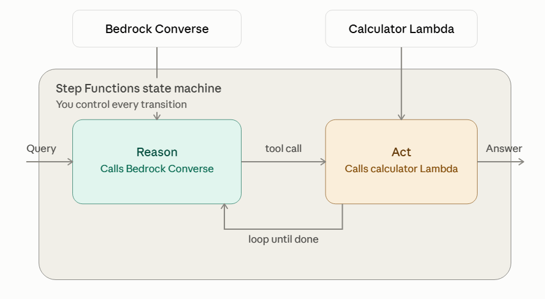
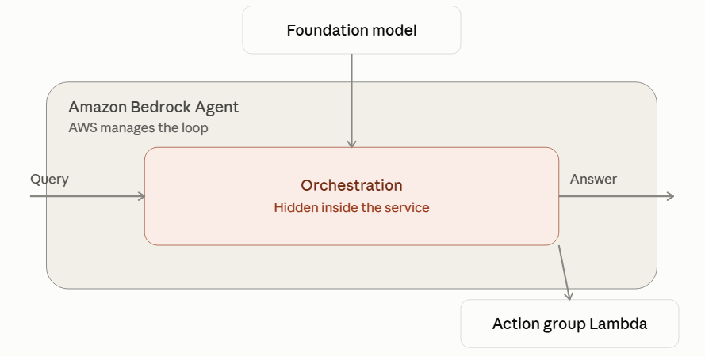
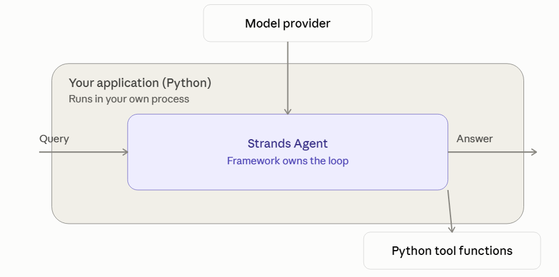

# agentic-scaffold
Step Functions, ReAct only, state machine + one trivial tool, Bedrock Converse for reasoning + IAM. No RAG, no multi-model routing, no human-in-the-loop gate. 

## Orchestrator comparison

| Step Functions ReAct | Bedrock Agents | Strands Agents |
|---|---|---|
|  |  |  |