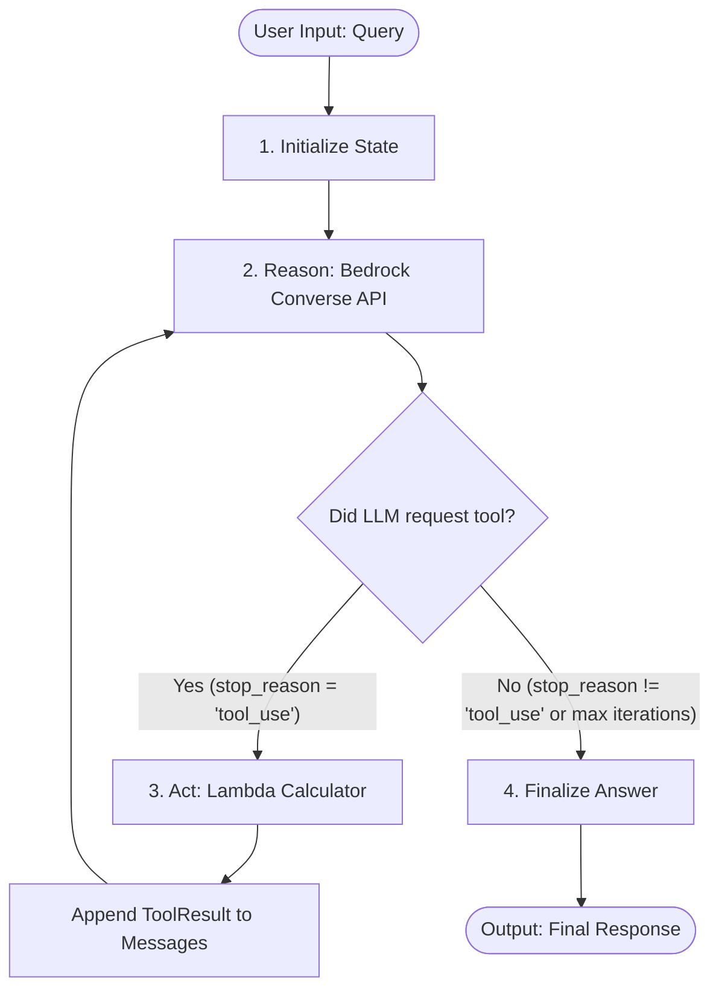

[](https://github.com/vimalkrishna/agentic-scaffold/actions/workflows/ci.yml)


# agentic-scaffold
Step Functions, ReAct only, state machine + one trivial tool, Bedrock Converse for reasoning + IAM. No RAG, no multi-model routing, no human-in-the-loop gate. 

A serverless, cloud-native **ReAct (Reason + Act)** agent loop built purely with **AWS Step Functions (JSONata)**, **Amazon Bedrock (Nova Lite)**, and **AWS CDK (Python)**. 
No heavyweight agent frameworks (no LangChain, CrewAI, or LlamaIndex)—just direct AWS service-to-service orchestration with fine-grained IAM permissions, full execution observability, and zero server management.

---
## Architecture & ReAct Flow
The agent runs as a Step Functions state machine using native **JSONata** query language for state manipulation and message history management.

### Execution Steps
1. **Initialize (`Pass`)**: Formats the incoming user prompt into Bedrock's `Messages` schema and initializes iteration counters.
2. **Reason (`CallAwsService -> bedrockruntime:converse`)**: Calls Bedrock Converse API with model `amazon.nova-lite-v1:0` and available tool definitions.
3. **Choice (`Choice`)**: Checks if Bedrock requested a tool (`stop_reason == 'tool_use'`) and iteration limit (`MAX_ITERATIONS = 5`) is not exceeded.
4. **Act (`LambdaInvoke`)**: Invokes the [`CalculatorTool`](app_constructs/react_loop/calculator_tool.py) Lambda function, formats the execution result as `ToolResult`, appends it to the conversation history, and loops back to **Reason**.
5. **Finalize (`Pass`)**: Extracts and returns the final text response once the model completes reasoning.
---
## Orchestrator Comparison
| Step Functions ReAct | Bedrock Agents | Strands Agents |
|---|---|---|
|  |  |  |
---
## Project Structure
```
agentic-scaffold/
├── app.py                      # CDK App entrypoint
├── cdk.json                    # CDK configuration ("app": "uv run python app.py")
├── Makefile                    # Standard developer tasks (lint, test, synth, ci)
├── pyproject.toml              # Python dependencies and tool configs (Python >= 3.13)
├── uv.lock                     # Deterministic dependency lockfile
│
├── stacks/
│   └── react_loop_stack.py     # CloudFormation Stack wiring constructs together
│
├── app_constructs/
│   └── react_loop/
│       ├── calculator_tool.py  # Lambda function tool + scoped CloudWatch IAM role
│       ├── iam.py              # Scoped Bedrock foundation model ARN helper
│       └── state_machine.py    # Step Functions ReAct state machine definition
│
├── scripts/
│   └── invoke_state_machine.py # CLI verification script to run queries against deployed agent
│
├── tests/
│   └── unit/
│       └── test_react_loop_stack.py # CDK assertion tests (resources, JSONata, IAM)
│
└── adr/                        # Architecture Decision Records
    ├── 0001-step-functions-react-as-bare-baseline.md
    ├── 0002-uv-owned-venv-and-cdk-json-app-entrypoint.md
    ├── 0003-pin-python-3-13-runtime.md
    └── 0004-cdk-nag-removed.md
```
---

## Quick Start
### 1. Clone and Install Dependencies
```bash
# Sync virtual environment and dependencies using uv
make sync
# or: uv sync
```
### 2. Run Tests and Quality Checks
```bash
# Run linter
make lint
# Run unit tests
make test
# Synthesize CloudFormation template
make synth
# Run all pre-commit checks
make ci
```
---

## Deployment
Deploy the stack to your AWS account:
```bash
uv run cdk deploy
```
Upon successful deployment, CDK outputs the `StateMachineArn`:
```
Outputs:
ReactLoopStack.StateMachineArn = arn:aws:states:us-east-1:123456789012:stateMachine:ReactLoop...
```
---
## Testing & Execution
Run an end-to-end reasoning query against the deployed state machine using the built-in CLI verification script:
```bash
uv run python scripts/invoke_state_machine.py \
    --state-machine-arn <YOUR_STATE_MACHINE_ARN> \
    "What is 12 * (3 + 4)?"
```
The script polls the Step Functions execution and prints the output:
```json
{
  "answer": "12 * (3 + 4) equals 84."
}
```
---
## Architecture Decision Records (ADRs)
Key architectural choices are documented under [`adr/`](adr/):
- [ADR-0001](adr/0001-step-functions-react-as-bare-baseline.md): Step Functions ReAct as bare baseline.
- [ADR-0002](adr/0002-uv-owned-venv-and-cdk-json-app-entrypoint.md): `uv`-owned venv and `cdk.json` app entrypoint.
- [ADR-0003](adr/0003-pin-python-3-13-runtime.md): Pin Python 3.13 runtime across CDK and Lambda.
- [ADR-0004](adr/0004-cdk-nag-removed.md): Removal of `cdk-nag` in favor of focused CDK assertions.